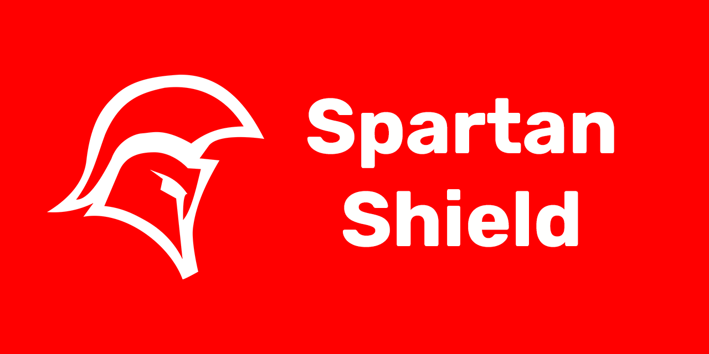

# Spartan Shield

## About

Spartan Shield is a desktop app designed to encrypt selected folders with almost unbreakable cryptography. It's ideal to keep your private data inside a public computer!

## Features

* Multi account support
* Select any folder you want
* Per-folder private key

## How to install

1. Download the latest release [here](https://github.com/Agentew04/SpartanShield/releases/latest)
2. Open the setup.exe file and follow the instructions
3. Have fun keeping your data safe!

## Future Roadmap

* Custom themes
* Usb support
